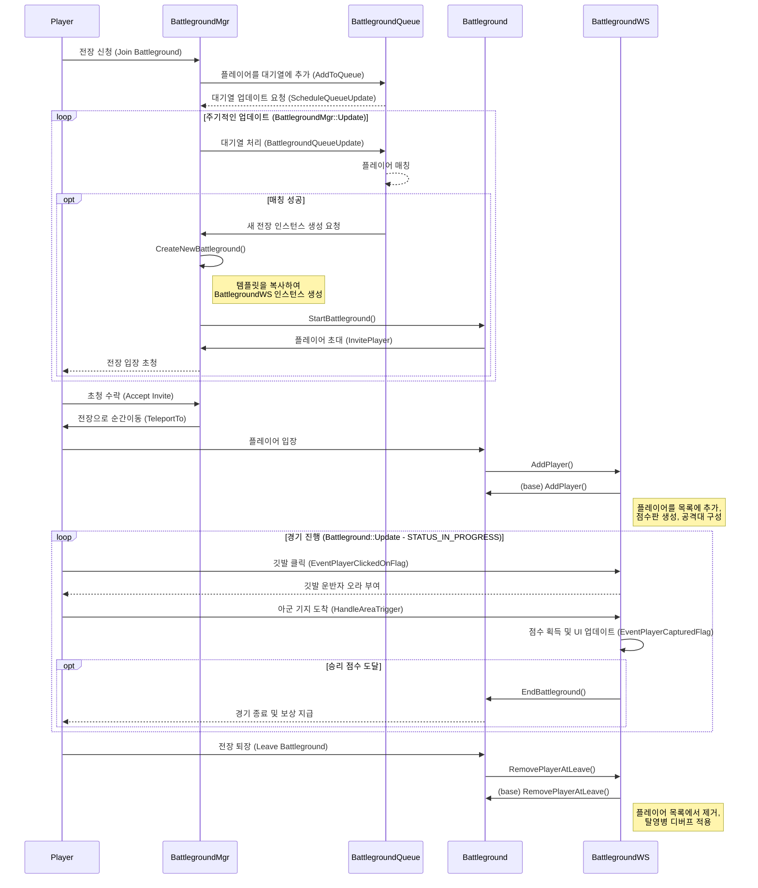

# Battlegrounds 시스템 분석

## 1. 아키텍처 개요

Battlegrounds 시스템은 세 가지 주요 구성 요소로 이루어진 계층적 구조를 가집니다.

1.  **`BattlegroundMgr`**: 전체 Battlegrounds 시스템을 관리하는 싱글톤 클래스입니다. 전장 인스턴스 생성, 삭제, 플레이어 대기열 관리, 주기적인 업데이트 루프 실행 등 시스템의 중심 허브 역할을 합니다.
2.  **`Battleground`**: 모든 전장의 기반이 되는 추상 기본 클래스입니다. 플레이어 관리, 점수 추적, 상태 관리(대기, 진행 중, 종료) 등 모든 전장이 공통으로 사용하는 속성과 기능을 정의합니다. 또한, `SetupBattleground`, `HandleAreaTrigger`와 같은 가상 함수를 통해 개별 전장이 고유한 게임 로직을 구현할 수 있는 인터페이스를 제공합니다.
3.  **구체적인 전장 구현체 (예: `BattlegroundWS`)**: `Battleground` 클래스를 상속받아 특정 전장(예: Warsong Gulch)의 고유한 규칙과 게임 플레이를 구현합니다. 깃발 뺏기, 거점 점령 등 각 전장의 핵심 메커니즘이 이 클래스에서 정의됩니다.

이러한 구조는 공통 기능을 기반 클래스에 통합하고 각 전장의 고유 로직을 분리함으로써 시스템의 유지보수성과 확장성을 높입니다.

## 2. 주요 클래스 상세

### 2.1. `BattlegroundMgr`

-   **역할**: Battlegrounds 시스템의 중앙 컨트롤러.
-   **주요 기능**:
    -   **초기화 (`LoadBattlegroundTemplates`)**: 서버 시작 시 데이터베이스에서 전장 템플릿 정보를 로드하여 메모리에 적재합니다.
    -   **인스턴스 관리 (`CreateNewBattleground`)**: 플레이어의 요청에 따라 `Battleground` 템플릿을 복사하여 새로운 전장 인스턴스를 생성합니다.
    -   **대기열 관리 (`m_BattlegroundQueues`)**: `BattlegroundQueue` 객체를 통해 플레이어의 전장 참가 신청을 받고, 레벨과 팀 균형을 고려하여 플레이어를 매칭합니다.
    -   **주기적 업데이트 (`Update`)**: 현재 진행 중인 모든 전장 인스턴스의 상태를 업데이트하고, 종료된 인스턴스를 정리하며, 대기열을 지속적으로 처리하여 새로운 경기를 시작합니다.

### 2.2. `Battleground`

-   **역할**: 모든 전장의 공통 기능을 제공하는 추상 기본 클래스.
-   **주요 기능**:
    -   **상태 기계 (`Update`)**: 전장의 상태를 `STATUS_WAIT_JOIN`(시작 대기), `STATUS_IN_PROGRESS`(진행 중), `STATUS_WAIT_LEAVE`(종료 대기)로 나누어 관리하며, 각 상태에 맞는 로직(시작 카운트다운, 부활 타이머, 자동 퇴장 처리 등)을 실행합니다.
    -   **플레이어 관리 (`AddPlayer`, `RemovePlayerAtLeave`)**: 전장 내 플레이어 목록을 관리하고, 플레이어 입장 시 전용 공격대 그룹에 자동으로 추가하며, 퇴장 시 '탈영병' 디버프를 적용하는 등의 공통 작업을 처리합니다.
    -   **이벤트 핸들링 (가상 함수)**: `HandleKillPlayer`, `EventPlayerClickedOnFlag` 등 하위 클래스에서 재정의(override)하여 사용할 수 있는 이벤트 핸들러 인터페이스를 제공합니다.
    -   **유틸리티 함수**: `SendPacketToTeam`, `UpdateWorldState` 등 전장 운영에 필요한 공통 유틸리티 함수를 제공합니다.

### 2.3. `BattlegroundWS` (Warsong Gulch 구현체)

-   **역할**: Warsong Gulch(노래방) 전장의 '깃발 뺏기' 규칙을 구체적으로 구현.
-   **주요 기능 (재정의된 함수 중심)**:
    -   **`SetupBattleground()`**: 맵에 깃발, 버프 아이템, 문 등의 게임 오브젝트를 배치합니다.
    -   **`EventPlayerClickedOnFlag()`**: 플레이어가 깃발을 클릭했을 때의 로직을 처리합니다. 깃발을 들게 하거나, 땅에 떨어진 깃발을 회수하는 등의 동작을 담당합니다.
    -   **`HandleAreaTrigger()`**: 깃발 운반자가 아군 기지에 도달했을 때 점수를 획득하는 로직을 처리합니다.
    -   **`EventPlayerDroppedFlag()`**: 깃발 운반자가 사망하거나 접속을 종료했을 때 깃발을 땅에 떨어뜨리고, 일정 시간 후 자동으로 기지로 돌아가도록 타이머를 설정합니다.
    -   **상태 추적**: `_flagState`, `_flagKeepers`와 같은 멤버 변수를 통해 양 팀 깃발의 현재 상태(기지, 운반 중, 바닥)와 깃발 운반자 정보를 실시간으로 추적합니다.

## 3. 전장 경기 수명 주기 (시퀀스 다이어그램)

