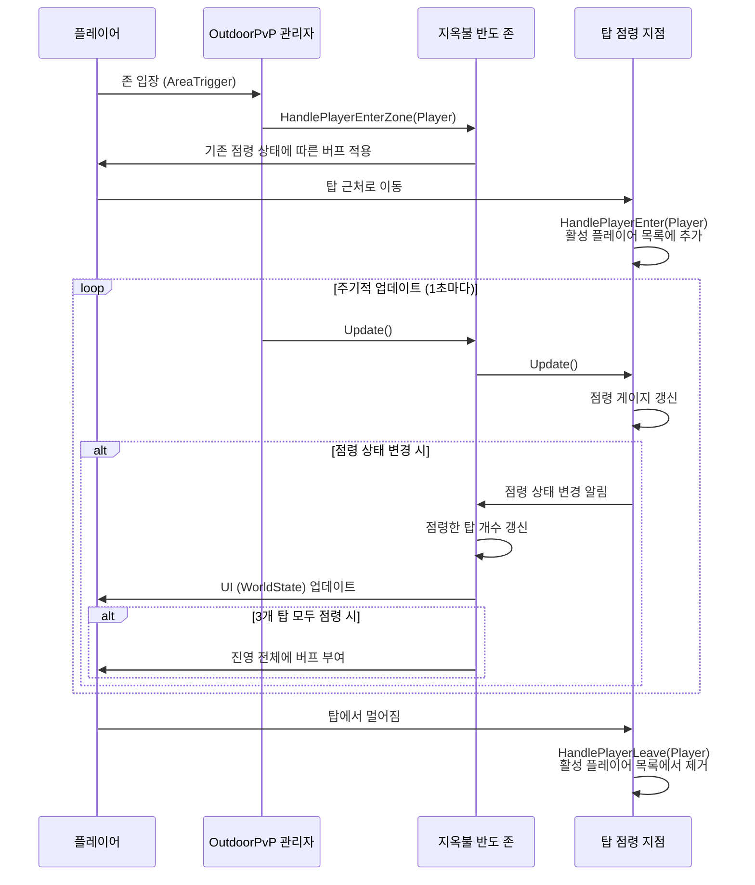

# Outdoor PvP 시스템 분석

## 1. 핵심 클래스 분석

### 1.1 `OutdoorPvPMgr`

**역할:**

`OutdoorPvPMgr`는 서버 내의 모든 Outdoor PvP 존을 총괄하는 싱글톤 관리자 클래스입니다. 서버가 시작될 때 초기화되어 모든 PvP 존의 생명주기를 관리하고, 플레이어와 관련된 전역 이벤트를 각 존에 전달하는 역할을 합니다.

**주요 기능:**

- **중앙 관리:** 서버에 존재하는 모든 `OutdoorPvP` 객체의 인스턴스를 소유하고 관리합니다.
- **이벤트 라우팅:** 플레이어가 특정 존에 들어가거나 나갈 때, 부활할 때 등의 이벤트를 감지하여 해당 존을 담당하는 `OutdoorPvP` 객체에 전달합니다.
- **주기적 업데이트:** 모든 `OutdoorPvP` 객체의 `Update()` 함수를 주기적으로 호출하여 각 존의 상태가 지속적으로 갱신되도록 합니다.
- **싱글톤 접근:** `sOutdoorPvPMgr` 매크로를 통해 코드 어디에서나 쉽게 접근할 수 있습니다.

**상호작용:**

- `OutdoorPvP` 객체들을 생성하고 `m_OutdoorPvPMap`에 존 ID와 함께 저장하여 관리합니다.
- 플레이어의 위치 변화를 감지하고, 존에 해당하는 `OutdoorPvP` 객체의 `HandlePlayerEnterZone`, `HandlePlayerLeaveZone`과 같은 메서드를 호출합니다.
### 1.2 `OutdoorPvP`

**역할:**

`OutdoorPvP`는 특정 Outdoor PvP 존(예: 지옥불 반도, 나그란드)의 로직을 처리하는 기본 클래스입니다. `ZoneScript`를 상속받아 특정 맵 एरिया의 스크립트 역할을 수행하며, 해당 존의 규칙, 상태, 오브젝트 등을 관리합니다.

**주요 기능:**

- **존 관리:** 담당하는 존에 속한 모든 점령 지점(`OPvPCapturePoint`)의 인스턴스를 관리합니다.
- **플레이어 관리:** 존에 들어오거나 나가는 플레이어를 추적하고, 관련 이벤트를 처리합니다.
- **이벤트 처리:** 존 내에서 발생하는 특정 이벤트(예: 플레이어 처치, 특정 지역 진입)를 처리하는 핸들러를 제공합니다.
- **상태 전송:** 존의 전반적인 상태(예: 각 진영이 점령한 탑의 수)를 플레이어의 UI에 표시하기 위해 `WorldState` 업데이트를 전송합니다.

**상호작용:**

- `OutdoorPvPMgr`로부터 플레이어 입장/퇴장 등의 이벤트를 전달받습니다.
- 포함하고 있는 모든 `OPvPCapturePoint` 객체의 `Update()`를 호출하여 개별 점령 지점의 상태를 갱신합니다.
- 특정 조건이 충족되면(예: 모든 거점 점령) 존에 있는 플레이어들에게 버프를 부여하거나 특별한 이벤트를 발생시킵니다.

### 1.3 `OPvPCapturePoint`

**역할:**

`OPvPCapturePoint`는 PvP 존 내의 개별 점령 지점(예: 탑, 깃발)을 나타내는 클래스입니다. 점령 상태와 관련된 모든 세부 로직을 담당합니다.

**주요 기능:**

- **점령 상태 관리:** 점령 지점의 현재 상태(중립, 얼라이언스 점령, 호드 점령, 전투 중 등)를 관리하고 상태 변화를 처리합니다.
- **점령 진행도:** 플레이어 수에 따라 점령 게이지(`_value`)를 변화시키고, 점령 완료 여부를 판단합니다.
- **플레이어 감지:** 점령 지점의 유효 범위 내에 있는 플레이어를 추적하여 점령 프로세스에 반영합니다.
- **오브젝트 제어:** 점령 상태에 따라 점령 지점의 외형(깃발, 방어막 등)을 변경하고 관련 게임 오브젝트를 생성하거나 삭제합니다.

**상호작용:**

- 부모인 `OutdoorPvP` 객체에 의해 주기적으로 업데이트됩니다.
- 점령 상태가 변경되면 `OutdoorPvP` 객체에 알리고, `OutdoorPvP`는 이 정보를 바탕으로 존 전체의 상태를 갱신합니다.
- 점령 지점 근처의 플레이어에게만 보이는 UI(예: 점령 게이지)를 직접 업데이트합니다.

## 2. 구현 사례 분석: 지옥불 반도 (OutdoorPvPHP)

지옥불 반도의 PvP 시스템은 `OutdoorPvP`와 `OPvPCapturePoint` 클래스를 상속받아 구현되었습니다.

- **`OutdoorPvPHP`**: `OutdoorPvP`를 상속받아 지옥불 반도 존 전체의 로직을 담당합니다.
- **`OPvPCapturePointHP`**: `OPvPCapturePoint`를 상속받아 3개의 탑(부서진 언덕, 감시의 언덕, 경기장)의 개별 점령 로직을 담당합니다.

### 2.1 초기화 (`SetupOutdoorPvP`)

1.  `OutdoorPvPHP::SetupOutdoorPvP()` 함수가 서버 시작 시 `OutdoorPvPMgr`에 의해 호출됩니다.
2.  이 함수는 3개의 `OPvPCapturePointHP` 인스턴스를 생성하여 각 탑의 위치와 고유 데이터를 설정합니다.
3.  점령 보상 버프가 적용될 지역들(지옥불 반도 및 관련 인스턴스 던전)을 등록합니다.

### 2.2 점령 프로세스 (`OPvPCapturePointHP::Update`)

1.  플레이어가 탑 근처로 이동하면 `HandlePlayerEnter`가 호출되어 해당 플레이어가 활성 플레이어 목록(`_activePlayers`)에 추가됩니다.
2.  `Update()` 함수는 매 주기(`OUTDOORPVP_OBJECTIVE_UPDATE_INTERVAL`)마다 각 진영의 플레이어 수를 비교하여 점령 게이지(`_value`)를 갱신합니다.
3.  점령 게이지가 한쪽 끝에 도달하면 탑의 소유권이 변경되고(`ChangeState()`), 탑의 외형이 바뀌며, 점령한 진영에게 메시지가 전송됩니다.

### 2.3 보상 및 전체 상태 관리 (`OutdoorPvPHP::Update`)

1.  `OPvPCapturePointHP`에서 탑의 소유권이 변경되면, `OutdoorPvPHP`는 각 진영이 점령한 탑의 총 개수(`m_AllianceTowersControlled`, `m_HordeTowersControlled`)를 갱신합니다.
2.  한 진영이 3개의 탑을 모두 점령하면, `TeamApplyBuff()`를 호출하여 해당 진영의 모든 플레이어에게 버프를 부여하고 상대 진영의 버프는 제거합니다.
3.  점령한 탑의 개수는 UI에 표시되도록 `SendUpdateWorldState`를 통해 클라이언트에 지속적으로 전송됩니다.

## 3. 이벤트 흐름 다이어그램

다음은 플레이어가 지옥불 반도의 탑을 점령하고 그 결과로 버프를 받기까지의 과정을 나타낸 시퀀스 다이어그램입니다.

## 4. 결론

AzerothCore의 Outdoor PvP 시스템은 매우 유연하고 확장 가능하도록 설계되었습니다.

- **모듈성:** `OutdoorPvPMgr`, `OutdoorPvP`, `OPvPCapturePoint`의 계층적 구조는 각자의 역할이 명확히 분리되어 있어 코드의 유지보수가 용이합니다.
- **확장성:** 새로운 PvP 존을 추가하기 위해서는 `OutdoorPvP`와 `OPvPCapturePoint`를 상속받는 새로운 클래스를 구현하고, 간단한 등록 과정을 거치기만 하면 됩니다. 이는 새로운 게임 플레이 메커니즘을 쉽게 도입할 수 있게 합니다.
- **데이터 기반 설계:** 점령 지점의 위치, 보상 주문 ID 등 주요 데이터가 상수나 설정 파일 형태로 관리되어 게임 디자인의 변경이 코드의 핵심 로직에 미치는 영향을 최소화합니다.

이러한 설계 덕분에 개발자는 각 PvP 존의 고유한 특징을 구현하는 데 집중할 수 있으며, 서버의 다른 부분에 영향을 주지 않고도 독립적으로 새로운 PvP 콘텐츠를 확장해 나갈 수 있습니다.
